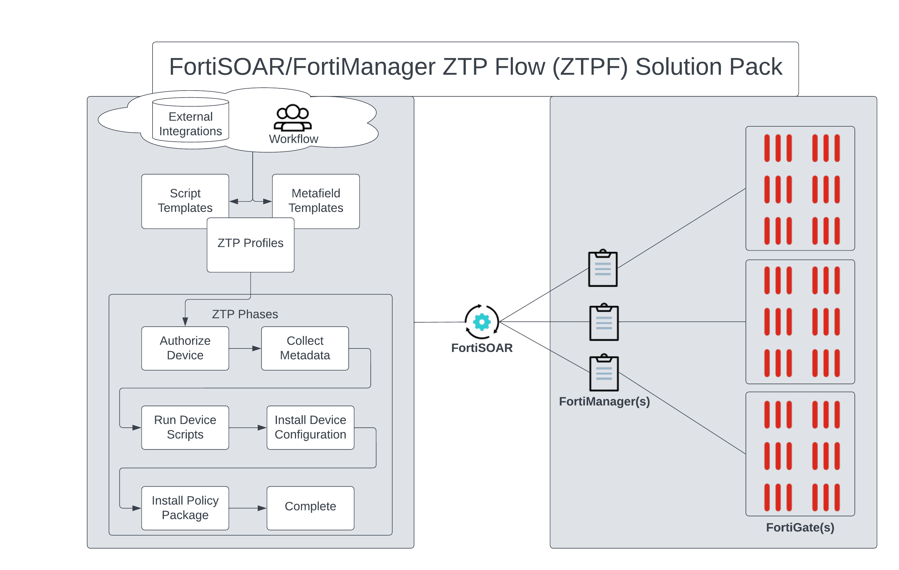

# FortiManager ZTP Flow 

# Release Information

 * **Version**: 1.0.0
 * **Certified**: No
 * **Publisher**: Fortinet CSE
 * **Compatible Version**: 
   * FortiSOAR v7.4.0 and later
   * FortiManager v7.2.0 and later for full features. Limited features for earlier FortiManager versions. 
 * [Release Notes](release_notes.md) 
 * [Changelog](./docs/changelog.md)

# Overview

The FortiManager ZTP Flow (ZTPF) Framework is a NOSOAR (Not Only SOAR) solution for streamlining provisioning and operational objectives on multiple FortiManagers. The power of FortiSOAR workflow and automation provides flexible solutions for onboarding, lifecycle, and offboarding objectives. FortiSOAR integrates with one or more FortiManagers via API and consumes asset details to be used for provisioning objectives. 

Playbook automations focused on FortiManager functions can streamline common tasks, such as but not limited to, metadata management, provisioning templates, custom device scripts, policy object templates, and device configuration installations. Workflows can be customized to integrate external systems, engage operational teams, or simple respond to conditions of network elements to achieve network operational tasks. Using an industry standard template language, [Jinja]( https://jinja.palletsprojects.com/en/3.1.x/), provisioners can easily pickup customized tempaltes. Use FortiSOAR as a portal to multiple FortiManagers or run in the background as an automated solution to ensure your [Fortinet Security Fabric](https://www.fortinet.com/solutions/enterprise-midsize-business/security-fabric) is managed to your exactly specifications. 

# Module Summary

## Managers
Manager records define the Fortimanagers, and the current firmware and status, used in your solution. Use this module to start the integration and/or simply report on the current status of your FortiMangers.

## Devices
Devices are synchronized from the FortiManager and stored in FortiSOAR. Then automations can occur on one or more devices based on operations and workflow needs. Once created in FortiSOAR they are not removed to preserve last known status of the Device record even if the device has been removed, or moved, from your FortiManager. 

## Metafield Templates
Managing metafields is crucial to the success of any network deployment and provisioning.  Metafield Templates can be used to prompt required users to respond to unknown, but required, fields before deployment. Templates can be used to integrate external systems and retrieve key data requirements before deployment. Templates can be customized to create dynamic metadata based on a wide range of advanced and complex requirements. Metadata inside FortiSOAR can be exports to FortiMaanger to be used by already existing solutions with minimal effort. 

## Script Templates
Scripts in FortiSOAR for this Solution Pack can be used for creating customized FortiManager CLI, Device DB, Policy DB, and/or TCL Scripts per device. Scripts in FortiSOAR can also maintain and create Provisioning CLI Templates in FortiManager such as when new ADOMs are created and need to be setup with Templates. Device reporting script can also be used to create a custom dashboard with user defined content.  

## ZTP Profiles
The ZTP Profiles module describes how to handle provisioning of each device maintained by the respective FortiManager. As a device shows up in the FortiManager Device DB, unauthorized or modeled, when ZTP Profiles are assigned to those devices the defined device templates and provisioning steps are applied and reported per device. ZTP Profiles can be assigned on demand or automatically assigned when devices are created in FortiManger regardless of how the devices were created.

# Examples
 - [Example1](./docs/example1.md): Provision of 4x Unauthorized FortiGates VMs in FortiManager starting by simply assigning a ZTP Profile.

 # Next Steps

| [Installation](docs/setup.md#installation) | [Configuration](docs/setup.md#configuration) | [Usage](docs/usage.md) | [Contents](docs/contents.md) |
|--------------------------------------------|----------------------------------------------|------------------------|------------------------------|