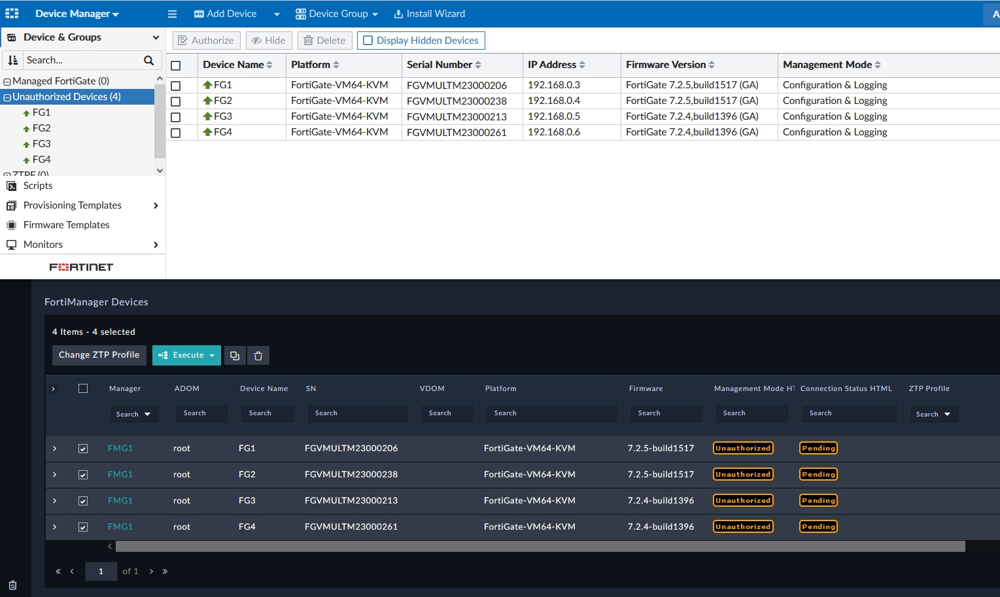

# [README](../README.md) -> Example1

## Provisioning Example Flow

In this example we will perform the following provisioning steps on 4x FortiGates that are in FortiManager and Unauthorized using one manual step to kick everything off. This manual step can be done automatically by changing the first ZTP Profile to `auto assign mode`. 

  1) Authorize the FortiGates for management.
  2) Create a pre provisioning device report.
  3) Create local admins with a special `admin_ro` profile. 
  4) Create VLAN interfaces using a `site_subnet`, `vlan_count`, and `vlan_cidr` variable per site. 
  5) Append all created VLAN Subnets to the site admins using the `admin_ro` profile. 
  5) Assign each site to the respective `Device Groups`, `Provisioning Template Groups`, and `Policy Package` inside FortiManager. 
  6) Create FortiManager `Address Objects` for each VLAN at each site. 
  7) Update the FortiManager Address Group `VLANS` with `Per Device Mapping` of each VLAN at each site to update the FortiManager `Policy Package`. 
  8) Push all the configurations to the sites using the `Install Device Config` and `Install Policy Package` features in FortiManager. 

## Unauthorized Devices
Devices in FortiManager are synchronized to FortiSOAR for handling. 

## Assign ZTP Profile
We will first manually select these devices and then assign the ZTP Profile `Report-and-Onboard`. 

The ZTP Profile describes the steps to be used in the `ZTP Step Map` settings. 

## Authorize Devices
The ZTP Profile kicks off the first ZTP Phase defined which is `Authorize` the device(s). We can see FortiSOAR performing these steps via the API in FortiManager. 

## ZTP Profile for Onboard & Reporting

The ZTP Profile also has templates that will run and in onboarding we run these report scripts. 

As the above scripts run on each device a device report is created as seen below. 

## ZTP Profile for Provisioning

ZTP Profiles, such as `Report-and-Onboard`, can kick off another profile with a different set of provisioning instructions by setting the `ZTP Profile Next` setting. 

Once assigned new phases will start on the devices. Here we can see that device metadata is being filled out by the profile `ZTPF-A.1` to continue our provisioning objectives. 

## FortiManager Setup is Complete

The devices in FortiManager are assigned and green. 

The FortiManager Address Object has been updated with subnets from each site. 

## ZTP Flow (ZTPF) is Complete

The provisioning in this example used a total of 4 ZTP Profiles to completely onboard each site. Each profile defined instructions for provisioning and can be assigned at any time. Therefore, sites already onboarded or simply modified, can be assigned any ZTP Profile to kick off the same instructions at any time. 

Once complete we can use reporting to confirm that we have provisioned everything as expected. This report can be invoked by assigning the last ZTP Profile, `Device-Post-Report`, at any time to simply perform a device report. 

