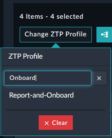

# Example 1
In this example we will perform the following actions:

## Manually Assign the ZTP Profile `Report-and-Onboard`. 
This profile creates a report of the current device configurations before onboarding.

### Unauthorized Devices

### Assign ZTP Profile

