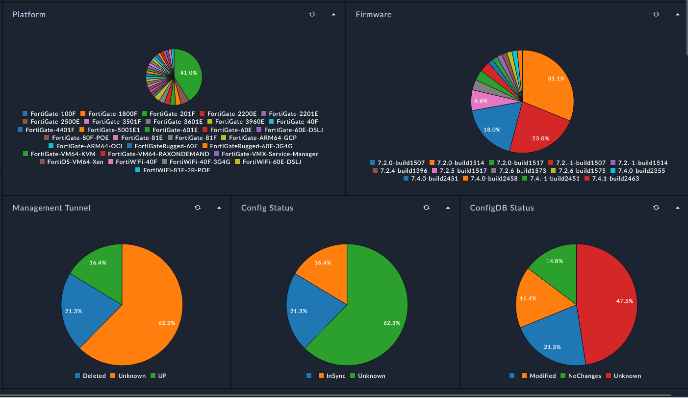
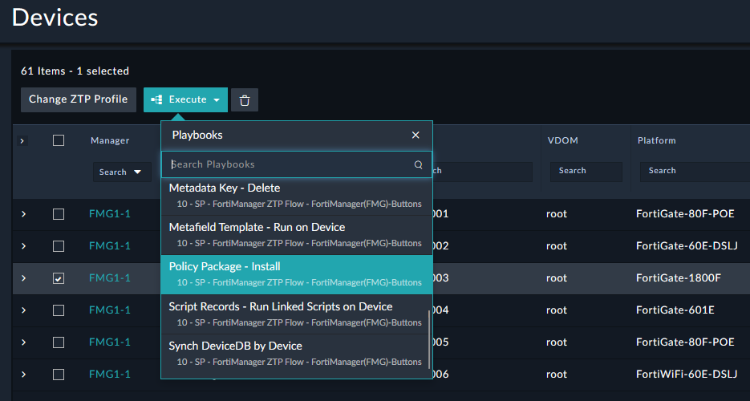

| [Home](../../README.md) / [Usage](../usage.md) |
|------------------------------------------------|

# Devices

## Summary

Device records are only created by the FMG `Synchronize DeviceDB` action and the data is populated in FortiSOAR for presentation. 

## Actions

Devices have a lot of actions that are available that can modify the Device record for preparing automation or kicking off automation to API calls to FMG for specific tasks. 

Actions are also exposed differently per other Device focused Dashboards such as the `Device Metadata Manager`. 

