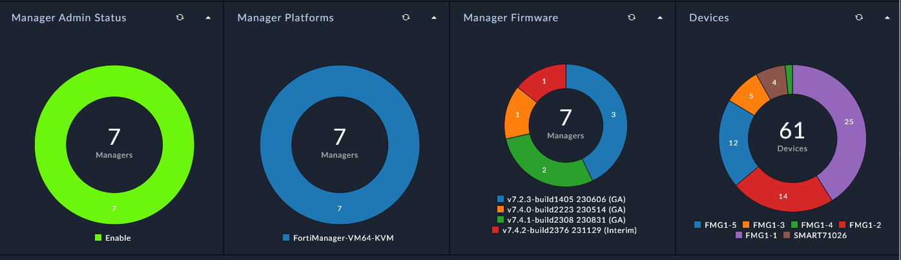
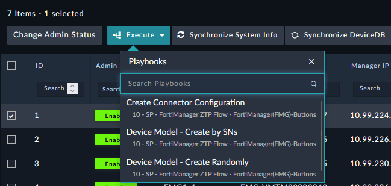

| [Home](../../README.md) / [Usage](../usage.md) |
|------------------------------------------------|

# Managers

## Summary

Creating Manger records only needs the `FortiManager Host`, `RPC User` and `RPC Password` and the rest of the information is gathered via the FMG API and stored in FortiSOAR. 

## Actions

Default Actions to the FMG records include bt are not limited to the below screenshot. 

