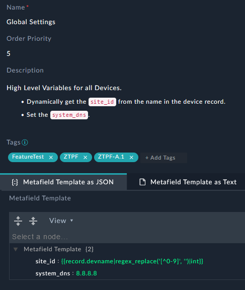
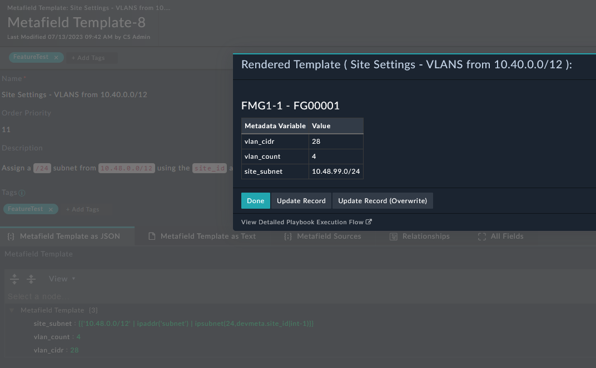

| [Home](../../README.md) / [Usage](../usage.md) |
|------------------------------------------------|

# Metafield Templates

## Example Template

Create Global Variables


Create Site Specific Variables. The record for metadata gets data using the following Jinja
```
{
  "site_subnet": "{{'10.48.0.0/12' | ipaddr('subnet') | ipsubnet(24,devmeta.site_id|int-1)}}",
  "vlan_count": "4",
  "vlan_cidr": "28"
}
```

When running the automation `Render Metafield Template with a Device`. 



Once Create these can be used in [Script Templates](./script_templates.md). 