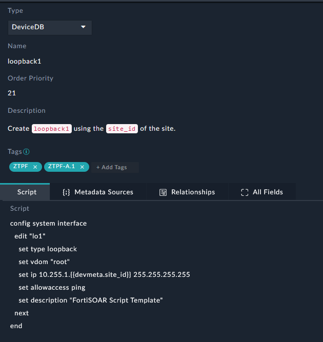
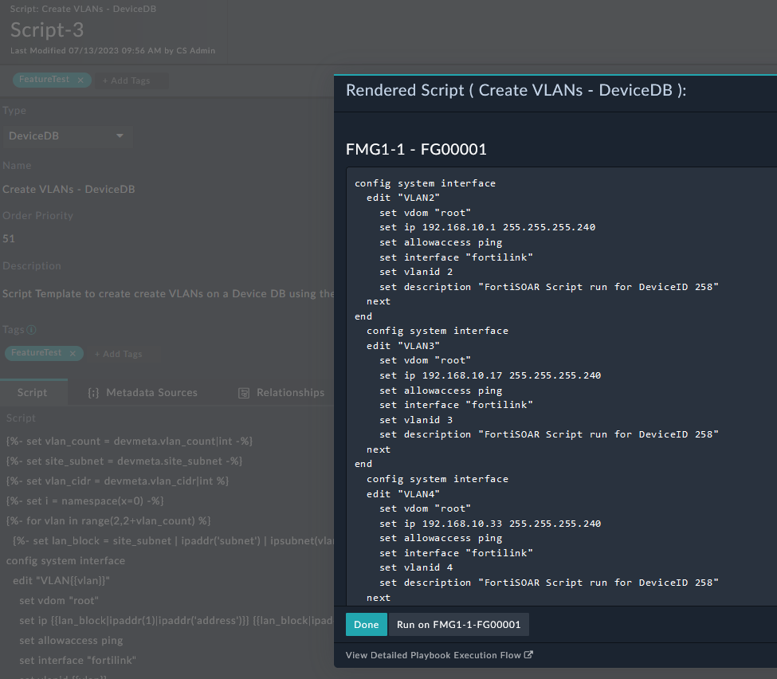

| [Home](../../README.md) / [Usage](../usage.md) |
|------------------------------------------------|

# Script Templates

## Script Types

| Type | Description | 
| ---- | ----------- |
| DeviceDB | Uses Jinja in FortiSOAR to create a DeviceDB script in the FMG, runs on the device, and then deletes the script from FMG when completed. | 
| PolicyDB | Uses Jinja in FortiSOAR to create a PolicyDB script in the FMG, runs on the Policy Package assigned to the device, and then deletes the script from FMG when completed. | 
| Remote CLI | Uses Jinja in FortiSOAR to create a Remote CLI script in the FMG, runs on the device, and then deletes the script from FMG when completed. |
| Remote TCL | Uses Jinja in FortiSOAR to create a Remote TCL script in the FMG, runs on the device, and then deletes the script from FMG when completed. |
| Provisioning CLI Template | Uses Jinja in FortiSOAR to create a Provisioning CLI script in the FMG and associates it to this device using the Provisioning Template Group defined in this device. | 
| Provisioning Jinja Template | Creates a Provisioning Jinja script in the FMG and associates it to this device using the Provisioning Template Group defined in this device. FortiSOAR will not render the Jinja in Jinja scripts that should be owned by FMG. |
| Report Markdown | Creates a locally hosted report output that gets appended to the `Report Markdown` field on the [Device](./devices.md) record.  | 


## Example Template

Templates can be as simple as creating a config block. 



Script Templates can also be full Jinja scripts to build a more complicated configuration.

```





  
config system interface
  edit "VLAN{{vlan}}"
    set vdom "root"
    set ip {{lan_block|ipaddr(1)|ipaddr('address')}} {{lan_block|ipaddr('netmask')}}
    set allowaccess ping
    set interface "fortilink"
    set vlanid {{vlan}}
    set description "FortiSOAR Script run for DeviceID {{record.id}}"
  next
end
  

```

